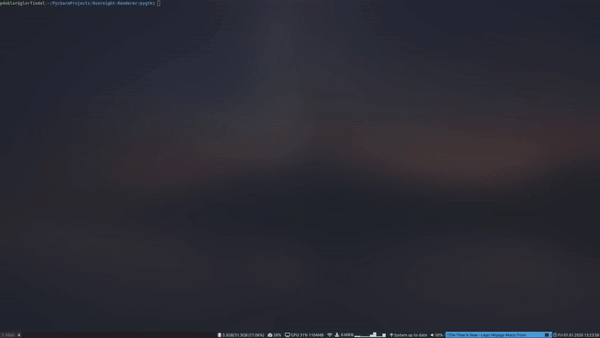

# Overnight-Renderer
This is a GUI application for rendering Blender projects overnight.

## Features
- Schedule an arbitrary number of rendering tasks
- Shut down or hibernate the computer after rendering
- Support for Cycles, EEVEE and Workbench render engines
- Configure render settings
- Define default directory for Blender projects
- List recent Blender files

## Requirements
- Python 3.6 or newer
- PyGObject
- GTK 3
- Additional Python packages
  - toml
  - trio
  - trio_gtk

## Note
Currently only GNU/Linux is supported (tested on Arch and Ubuntu 20.04).
